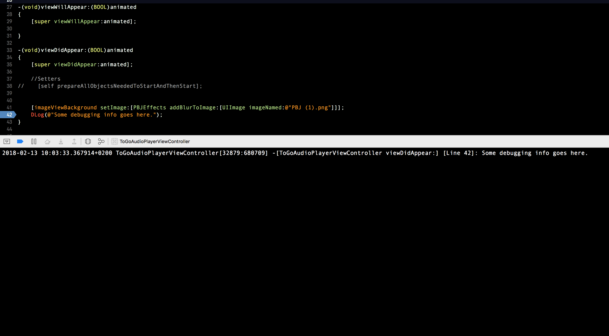

# PBJDebuggingTools

[](https://travis-ci.org/SnugJoker/PBJDebuggingTools)
[](http://cocoapods.org/pods/PBJDebuggingTools)
[](http://cocoapods.org/pods/PBJDebuggingTools)
[](http://cocoapods.org/pods/PBJDebuggingTools)

[](https://bettercodehub.com/)

[](https://paypal.me/JoeRazon)


### Content       
* DLog     

## Requirements
No requirements needed.

## Example


## Installation
PBJDebuggingTools is available through [CocoaPods](http://cocoapods.org). To install
it, simply add the following line to your Podfile:

```ruby
pod 'PBJDebuggingTools'
```

## How To Use
To use PBJDebuggingTools first import the class:

*Import
```objectivec
#import <PBJDebuggingTools/PBJDLog.h>
```

Then simply add one of the methods to your code:
```objectivec
DLog(@"");
```
```objectivec
ALog(@"");
```
```objectivec
ULog(@"");
```

## Author
Joseph Razon, razonjoe@gmail.com

## License
PBJDebuggingTools is available under the MIT license. See the LICENSE file for more info.
